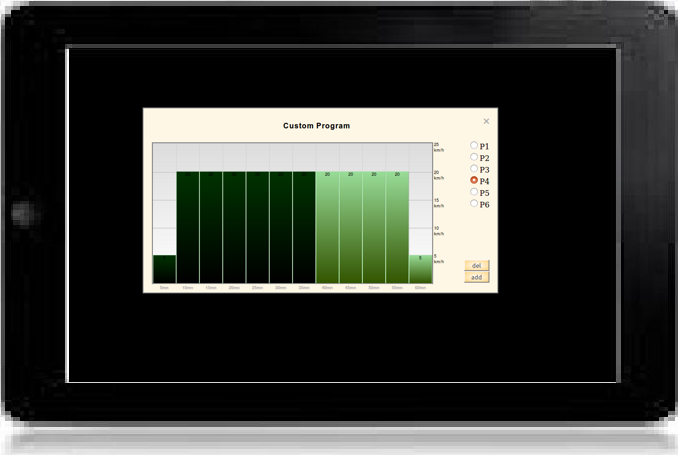
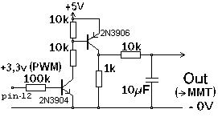
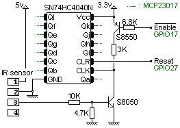
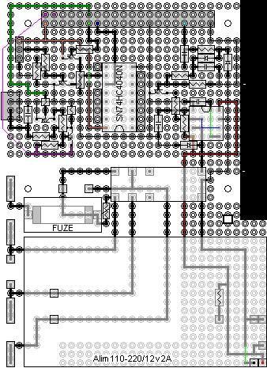

Treadmill
=========

A Node.js interface to control a Torpedo treadmill.

Software:
---------

* click on the chrono to select a program (duration, distance or custom program),
* close the popup of the bargraph to launch the program,
* a program can be modified or replaced during a run,
* click on a bar to grow it (increase the speed),
* click below the bar to reduce it (decrease the speed),
* other custom programs can be created at will.

Hardware:
---------

* 1 treadmill without any fonctional motherboard available, 
* 1 motor interface 180v DC 1HP (MMT-90/180DR10AL-01),  
* 1 Raspberry PI 3,
* 1 MCP23017 and Expander HAT Board, 
* 1 SN74HC4040N,  
* one relay and a few small components...   
* IRSensor foot 
* last tests   

