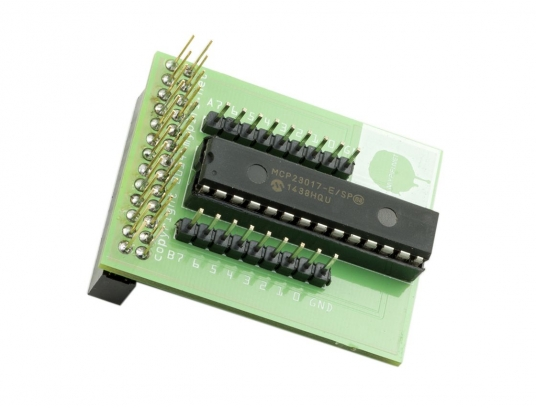

Treadmill
=========

A Node.js interface to control a Torpedo treadmill.

Software:
---------

* click on the chrono to select a program,
* close the popup of the bargraph to launch the program,
* a program can be modified or replaced during a run,
* click on a bar to grow it,
* click below the bar to make it decrease,
* other custom programs can be created at will.

Hardware:
---------

* 1 treadmill without fonctional motherboard available, 
* 1 motor interface 180v DC 1HP (MMT-90/180DR10AL-01),  
* 1 Raspberry PI 3,
* 1 MCP23017 and Expander HAT Board, 
* 1 SN74HC4040N, 
* 1 infrared sensor, 
* one timed relay, resistors, 2N2222 and a few small components... 

